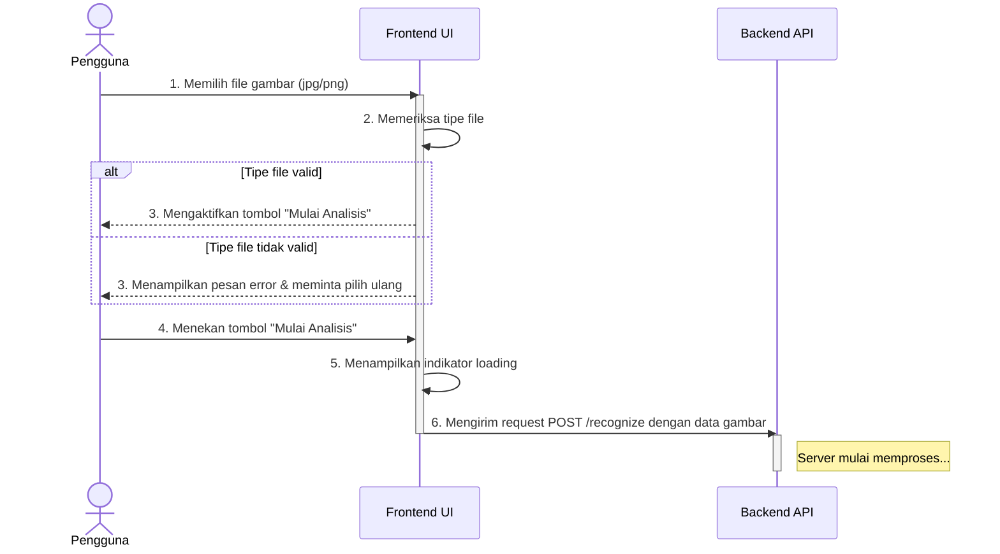
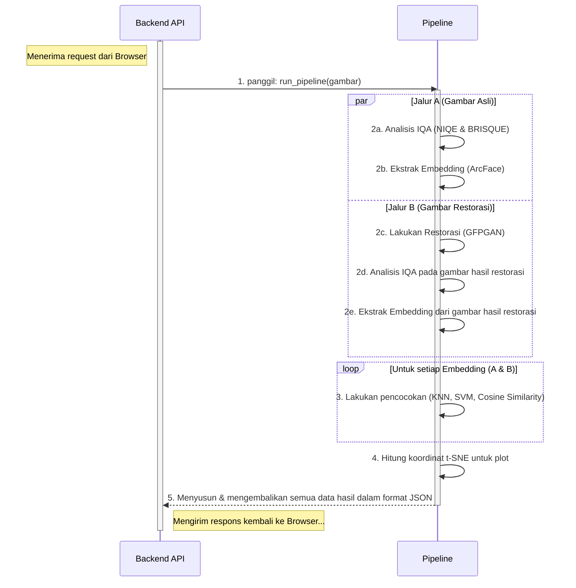
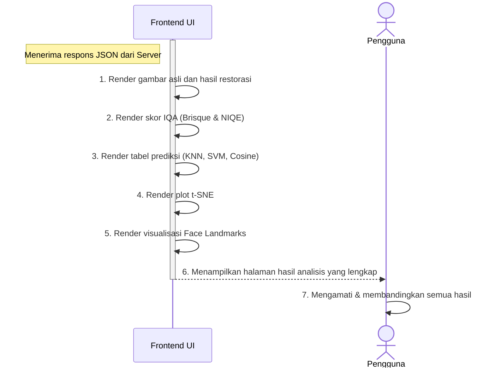
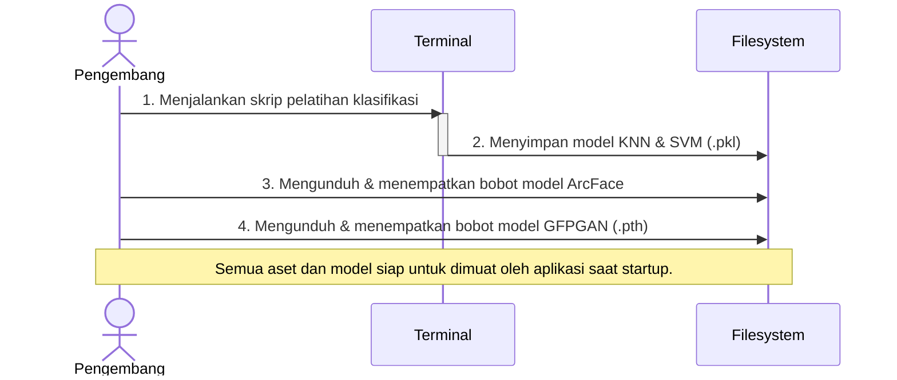

## Sequence Diagrams - VisioRecog App (Based on Activity Diagrams)

Berikut adalah 4 diagram sekuens yang dibuat berdasarkan Activity Diagram yang Anda berikan. Diagram ini mencakup semua alur kerja untuk aktor Pengguna dan Pengembang.

**Cara Melihat Visualisasi:**
1. Salin seluruh blok kode yang ada di dalam ` ```mermaid ... ``` `.
2. Buka [**Mermaid Live Editor**](https://mermaid.live).
3. Tempel kode tersebut di panel "Code" untuk melihat diagramnya.

---

### Diagram 1: Memulai Analisis oleh Pengguna
*Mencakup aktivitas: "Mengunggah Gambar Wajah" & "Memulai Analisis"*



---

### Diagram 2: Proses Analisis di Backend
*Mencakup aktivitas: "Proses Restorasi dan Rekognisi", "Mengidentifikasi Subjek", "Restorasi Subjek"*



---

### Diagram 3: Menampilkan Hasil kepada Pengguna
*Mencakup aktivitas: "Melihat Hasil Restorasi dan Rekognisi" & "Melihat Plot Embedding dan Face Landmarks"*



---

### Diagram 4: Persiapan Aset oleh Pengembang
*Mencakup aktivitas: "Mempersiapkan Model Klasifikasi", "Mempersiapkan Model Restorasi", "Mempersiapkan Model Rekognisi"*


