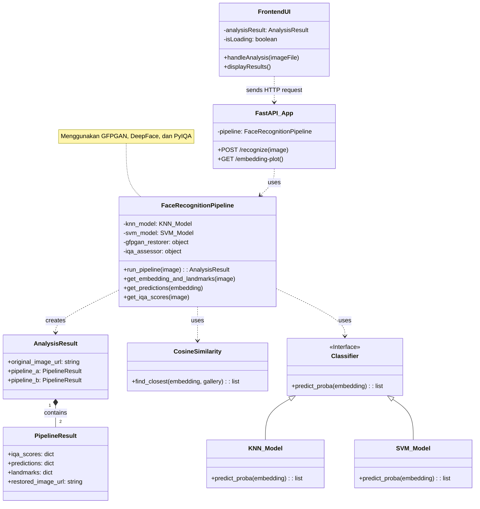

# Class Diagram - VisioRecog App (Detailed Compact)

```mermaid
classDiagram
    direction TB

    class FrontendUI {
        -analysisResult: AnalysisResult
        -isLoading: boolean
        +handleAnalysis(imageFile)
        +displayResults()
    }

    class FastAPI_App {
        -pipeline: FaceRecognitionPipeline
        +POST /recognize(image)
        +GET /embedding-plot()
    }

    class FaceRecognitionPipeline {
        -knn_model: KNN_Model
        -svm_model: SVM_Model
        -gfpgan_restorer: object
        -iqa_assessor: object
        +run_pipeline(image) : AnalysisResult
        +get_embedding_and_landmarks(image)
        +get_predictions(embedding)
        +get_iqa_scores(image)
    }

    class Classifier {
        <<Interface>>
        +predict_proba(embedding) : list
    }

    class KNN_Model {
      +predict_proba(embedding) : list
    }
    class SVM_Model {
      +predict_proba(embedding) : list
    }
    class CosineSimilarity {
      +find_closest(embedding, gallery) : list
    }

    class AnalysisResult {
      +original_image_url: string
      +pipeline_a: PipelineResult
      +pipeline_b: PipelineResult
    }

    class PipelineResult {
      +iqa_scores: dict
      +predictions: dict
      +landmarks: dict
      +restored_image_url: string
    }

    note for FaceRecognitionPipeline "Menggunakan GFPGAN, DeepFace, dan PyIQA"

    FrontendUI ..> FastAPI_App : sends HTTP request
    FastAPI_App ..> FaceRecognitionPipeline : uses
    FaceRecognitionPipeline ..> AnalysisResult : creates
    
    FaceRecognitionPipeline ..> Classifier : uses
    FaceRecognitionPipeline ..> CosineSimilarity : uses

    Classifier <|-- KNN_Model
    Classifier <|-- SVM_Model

    AnalysisResult "1" *-- "2" PipelineResult : contains

```
