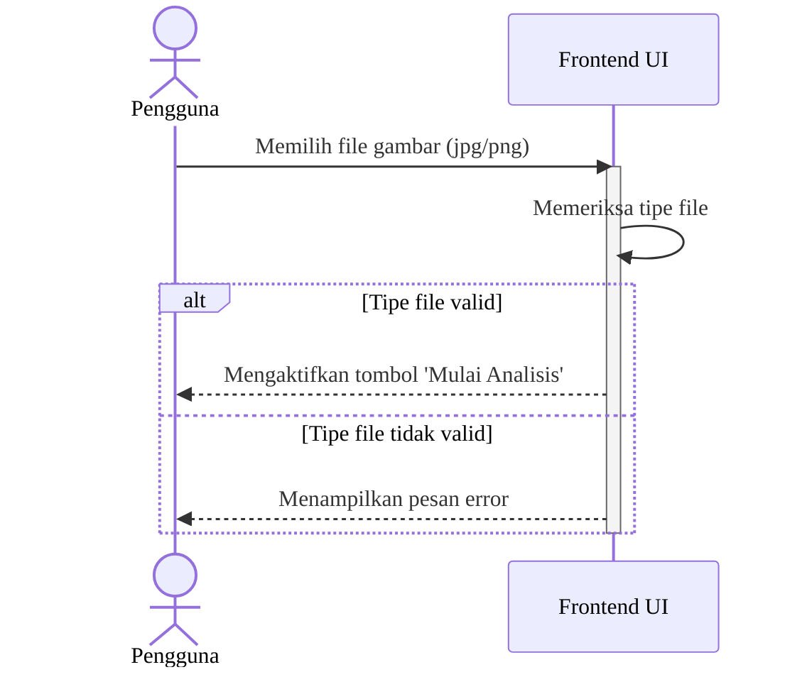
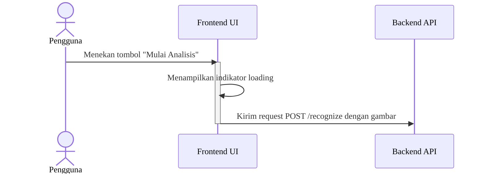
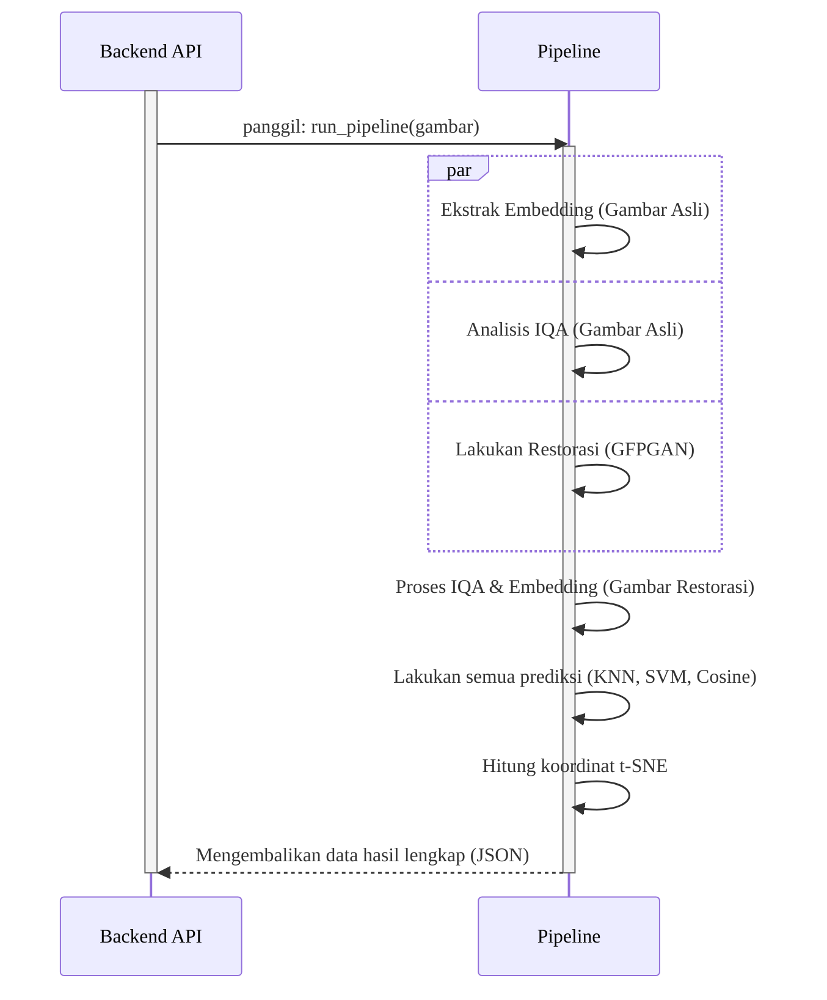
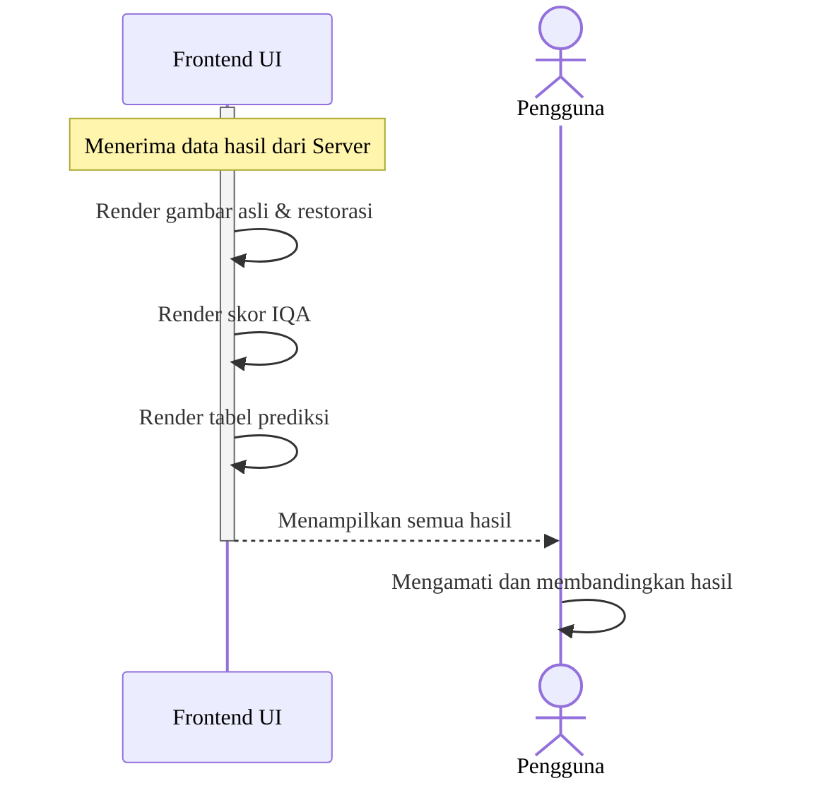
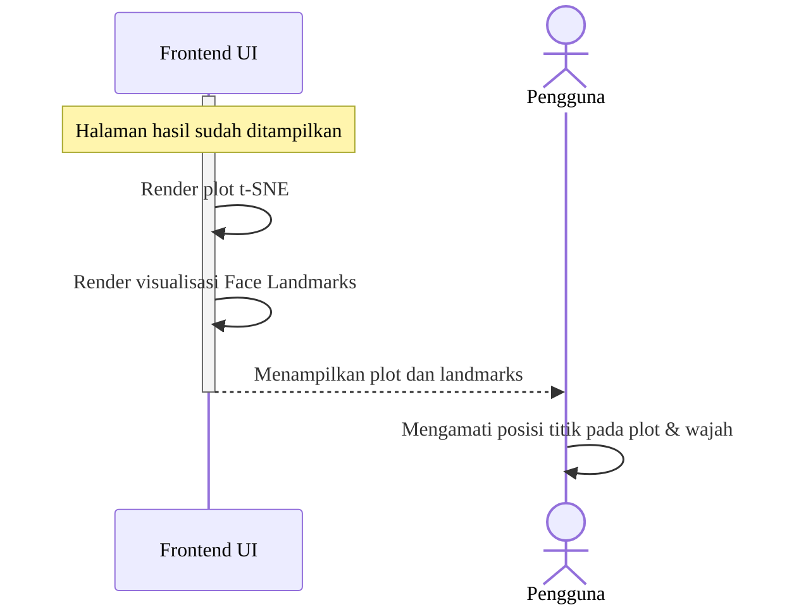
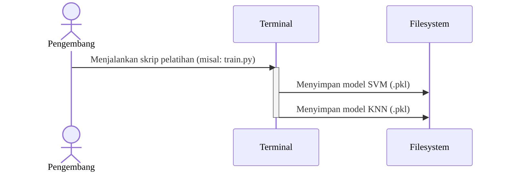
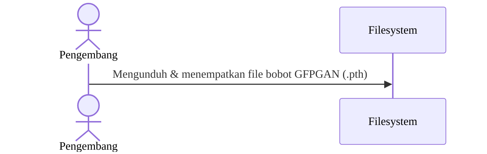
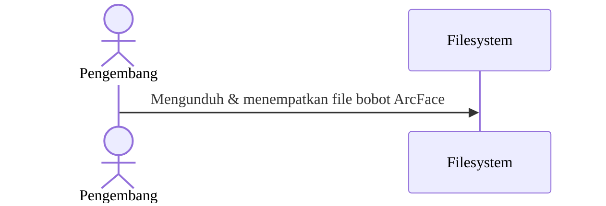
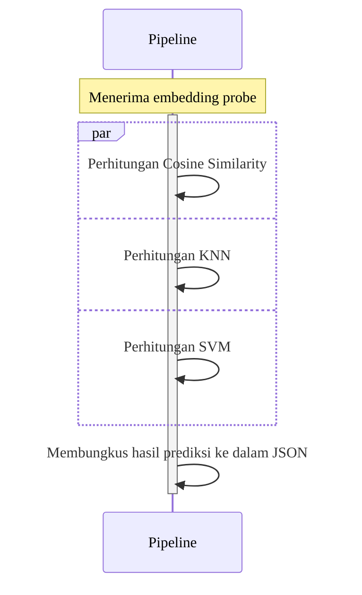
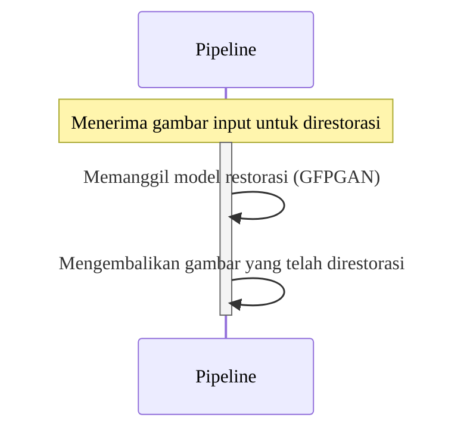

## 10 Sequence Diagrams (Granular)

Berikut adalah 10 diagram sekuens yang dibuat satu per satu berdasarkan 10 Activity Diagram yang Anda berikan.

**Cara Melihat Visualisasi:**
1. Salin seluruh blok kode yang ada di dalam ` ```mermaid ... ``` ` untuk satu diagram.
2. Buka [**Mermaid Live Editor**](https://mermaid.live).
3. Tempel kode tersebut di panel "Code" untuk melihat diagramnya.

---

### 1. Mengunggah Gambar Wajah



---

### 2. Memulai Analisis



---

### 3. Proses Restorasi dan Rekognisi



---

### 4. Melihat Hasil Restorasi dan Rekognisi



---

### 5. Melihat Plot Embedding dan Face Landmarks



---

### 6. Mempersiapkan Model Klasifikasi



---

### 7. Mempersiapkan Model Restorasi



---

### 8. Mempersiapkan Model Rekognisi



---

### 9. Mengidentifikasi Subjek



---

### 10. Restorasi Subjek

*Catatan: Activity diagram untuk ini tampak identik dengan "Mengidentifikasi Subjek". Diagram sekuens berikut dibuat berdasarkan **nama** aktivitasnya, yaitu restorasi.*


