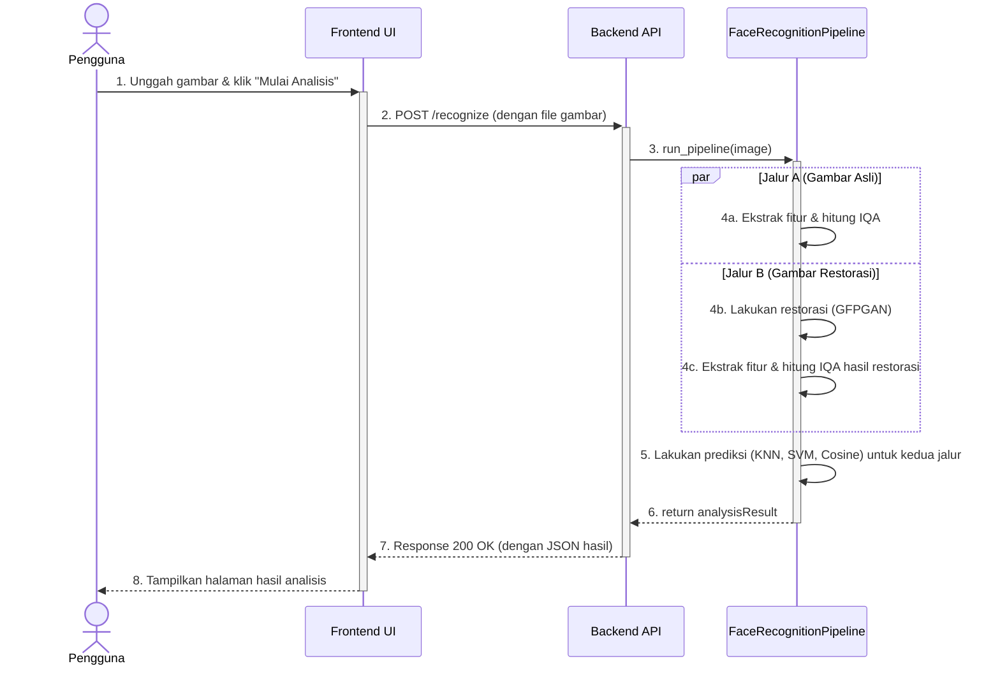
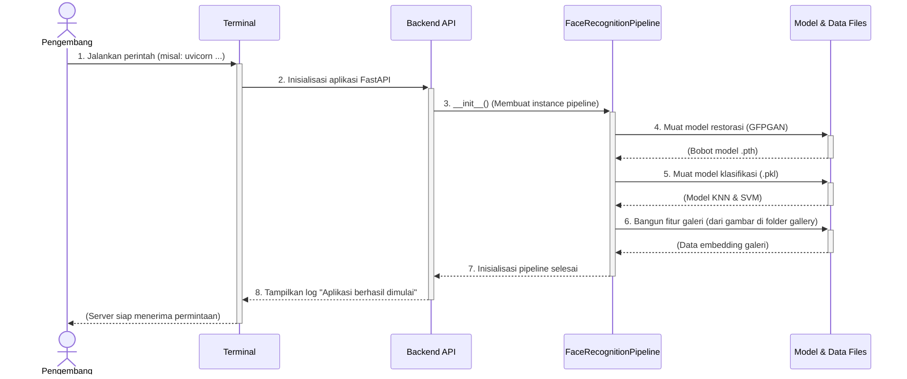

## Sequence Diagrams - VisioRecog App

Di bawah ini adalah dua diagram sekuens yang menggambarkan alur kerja untuk masing-masing aktor: Pengguna dan Pengembang.

**Cara Melihat Visualisasi:**
1. Salin seluruh blok kode yang ada di dalam ` ```mermaid ... ``` `.
2. Buka [**Mermaid Live Editor**](https://mermaid.live).
3. Tempel kode tersebut di panel "Code" untuk melihat diagramnya.

---

### 1. Diagram Alur Pengguna Akhir

Diagram ini menunjukkan urutan kejadian dari saat pengguna mengunggah gambar hingga hasil analisis ditampilkan.



---

### 2. Diagram Alur Inisialisasi Sistem (Pengembang)

Diagram ini menunjukkan urutan kejadian saat pengembang menyalakan server backend, di mana semua model dan konfigurasi dimuat ke dalam memori.


